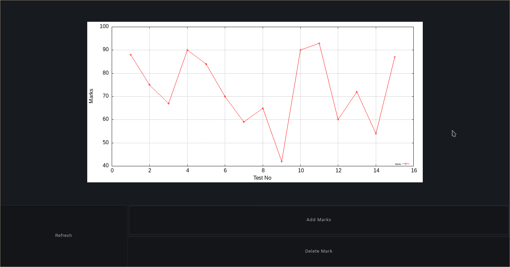

# marks-display
A program that plots my marks and displays them in gtk.
Can add and delete mark entries

## Prerequisites
- [SBCL](https://www.sbcl.org)
- [Quicklisp](https://www.quicklisp.org)
- gnuplot
